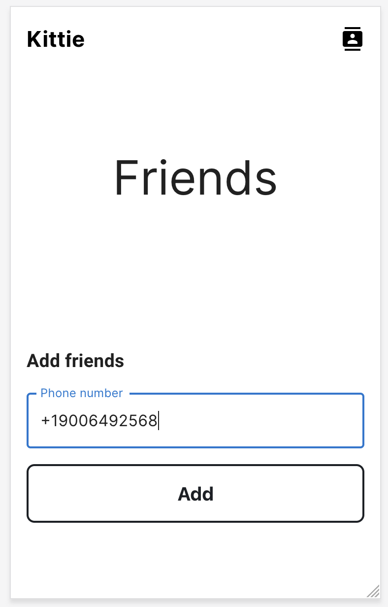
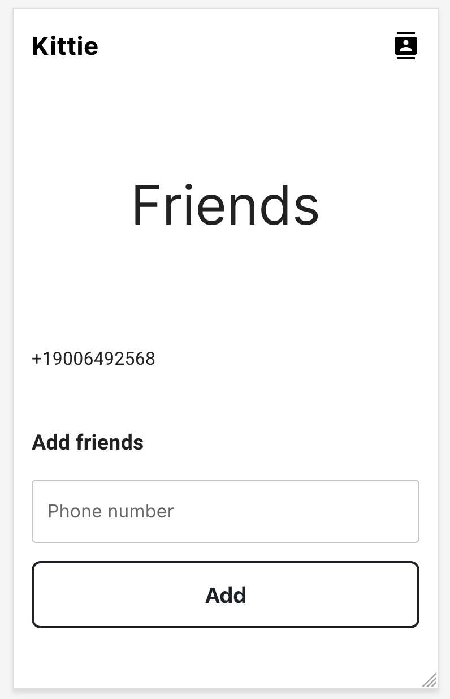
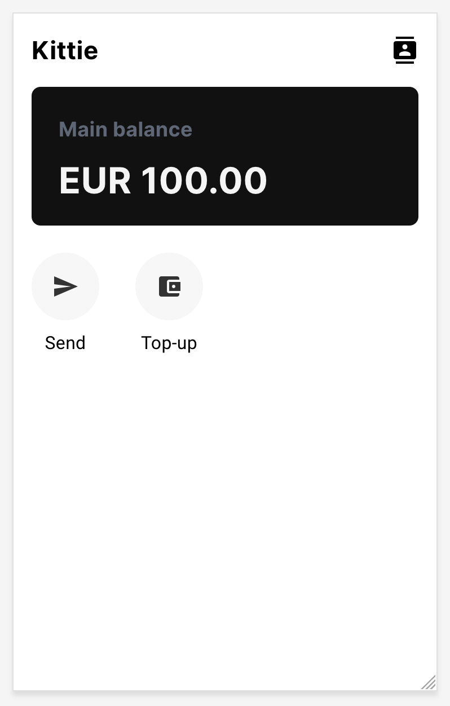
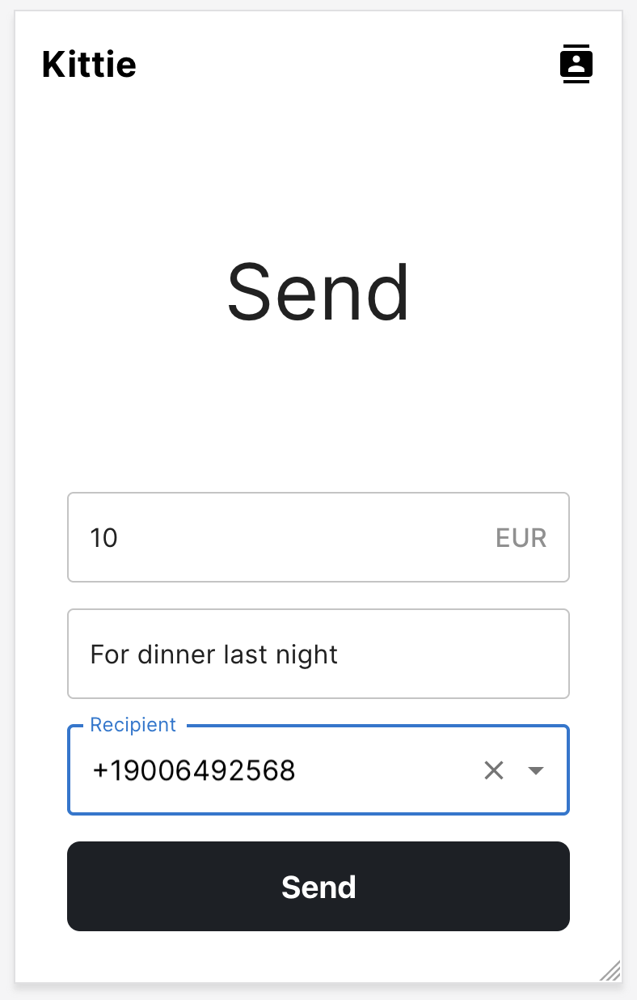
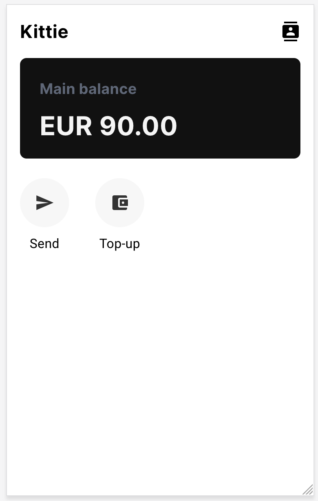
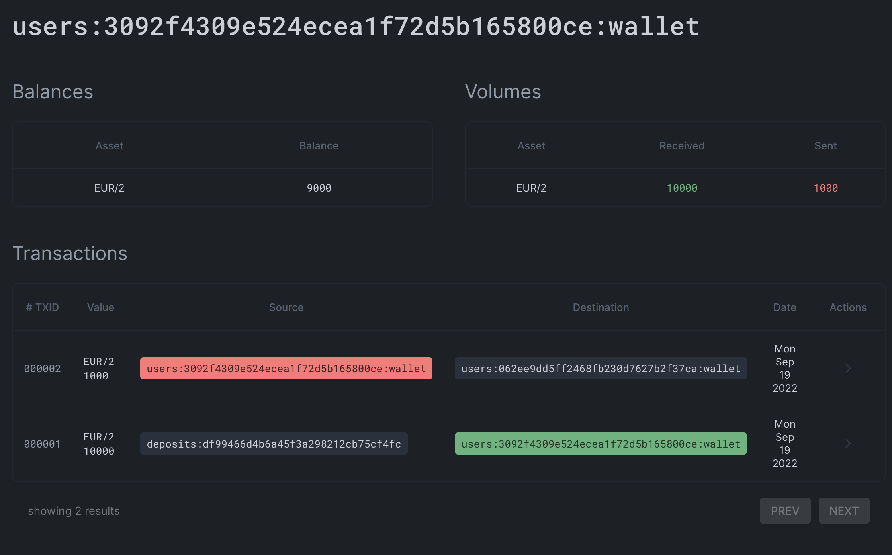
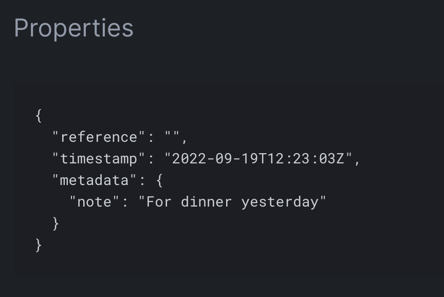

# Step 3: Adding Friends & Transferring Funds

Let's step into the core functionality of Kittie. One key feature is the ability to transfer money to your friends. We're going to add this feature now. Specifically, in this step we will:

- Add backend support for adding and listing friends
- Add UI for adding and listing friends
- Add API support for transferring funds to a friend
- Write Numscript for recording the transfer to our ledger
- Add UI for sending friends money

To fully test this step, you'll need to grab an actual friend (or a second phone with a different phone number). So be prepared at the end to find a buddy. (No real money will be changing hands, of course!)

First things first. You might need to discard any changes or edits you made in Step 2 (feel free to copy them to another folder first!). Then checkout branch step-3:

```bash
git reset --hard
git checkout step-3
```

Finally, make sure your frontend, backend, ledger, and Stripe webhook receiver are running in seperate terminals:

```bash
yarn run frontend
```

```bash
yarn run backend
```

```bash
yarn run ledger
```

```bash
yarn run stripe
```

## Add backend support for friends

Let's add API endpoints for viewing your list of friends, and adding a new friend. This means writing service code to execute the necessary database queries, and then an Express API wrapper for that service.

### Friends service code

First, let's update our database schema to add a entry for friends lists. Friends lists are a many-to-many relationship: Each person can have zero or more friends, and each person can appear on zero or more friends lists. Open `src/server-app/db/entities/User.ts` and add this code at line 27, before the final closing curly brace:

```ts
  @ManyToMany(() => User, (user) => user.friends)
  @JoinTable()
  friends: Promise<User[]>;
```

Next we'll add a new service—create a file called `src/server-app/service/friends.ts`. In this file, we're going to create two functions:

- `myFriends()` which will return a list of the logged-in user's friends
- `addFriend(phoneNumber)` which will add a friend to the logged-in user's friends list by their phone number.

```ts
import { User } from "../db/entities/User";

export const myFriends = async (userId: string) => {
  const user = await User.findOneBy({
    id: userId,
  });

  if (!user) {
    return [];
  }

  return [
    ...await user.friends,
  ];
}
```

This function queries the database for a user that matches the logged-in user, and returns their list of friends. If the requested friend is unknown (because they don't yet have an account), the function returns an empty list. Since this function will only ever be called by a logged-in user, this error case should never happen, but you never know!

Continuing, add this code to the bottom of the file:

```ts
export const addFriend = async (userId: string, phoneNumber: string) : Promise<User[]> => {
  const user = await User.findOneBy({
    id: userId,
  });

  if (!user) {
    return [];
  }

  const friend = await User
    .getRepository()
    .createQueryBuilder()
    .where('"phoneNumber" = :phoneNumber', { phoneNumber })
    .getOne();

  if (!friend) {
    return user.friends;
  }

  user.friends = user.friends || Promise.resolve([]);
  user.friends = Promise.resolve([
    ...await user.friends,
    friend,
  ]);

  await user.save();

  return user.friends;
}
```

Here we do a little validation. To add a friend, you need to specify their phone number. Here, we look to see if there is a user with that phone number. If not, simply return the existing friends list. Otherwise, we create an association between the user and the friend, and return the updated list. This means that adding friends without accounts will silently fail, and is a great place for you to jump in independently to improve the behavior of the code!

### Friends API endpoints

Now that we have the service working, let's add the API endpoints. Create a new file called `src/server-app/api/friends.ts` with the following code:

```ts
import { Router } from "express";
import { addFriend, myFriends } from "../service/friends";

export const app = Router();

app.get('/', async (req: any, res) => {
  const friends = await myFriends(req.auth['userId']);

  res.json(friends);
});

app.post('/', async (req: any, res) => {
  const friends = await addFriend(req.auth['userId'], req.body.phoneNumber);

  res.json({
    friends,
  });
});
```

This adds two endpoints that are thin Express wrappers around our service code. Notice adding a friend does not return an error when the friend cannot be found—you can likely find ways to improve this behavior.

Finally, add the API endpoints to the Express router in `src/server-app/api/main.ts`. At line 20 add:

```ts
import { app as friends } from './friends';
```

Then at line 57 add:

```ts
app.use('/api/friends', friends);
```

And done! The backend should automatically reload as you add elements, but you might want to restart it just in case it ran into a compilation error while you were editing these files.

## Add UI elements to list and add friends

Now that the backend functionality is in place, let's get the frontend elements working. We're going to add a new page for adding and listing friends. Then we're going to add another page for sending money to someone on your friends list.

Let's start with the friendlist page. Create a new file called `src/front-app/pages/Friends.tsx`, and add the following code:

```tsx
import { Box, Container, TextField } from '@mui/material';
import * as React from 'react';
import { api } from '../lib/api';
import { Button } from './components/Button';
import { Navbar } from './components/Navbar';
import { PageHead } from './components/PageHead';

export const Friends = () => {
  const [search, setSearch] = React.useState('');
  const [friends, setFriends] = React.useState<any[]>([]);

  React.useEffect(() => {
    const fetchFriends = async () => {
      const res = await api.get('/friends');
      setFriends(res.data);
    }

    fetchFriends();
  } , []);

  const addFriend = async (phoneNumber: string) => {
    if (!phoneNumber) {
      return;
    }

    const res = await api.post('/friends', { phoneNumber });
  };

  return (
    <>
      <Navbar></Navbar>
      <PageHead>Friends</PageHead>
      <Container>
        <Box sx={{
          mb: 6,
        }}>
          {friends.map(friend => (
            <Box key={friend.id} sx={{
              display: 'flex',
            }}>
              <Box>
                <span>{friend.phoneNumber}</span>
              </Box>
              <Box sx={{
                ml: 'auto',
              }}>
            {/* Add controls here */}
              </Box>
            </Box>
          ))}
        </Box>
        <Box>
          <h3>Add friends</h3>
          <Box sx={{
            display: 'flex',
            flexDirection: 'column',
            gap: 2,
          }}>
            <TextField
              label="Phone number"
              value={search}
              onChange={(e) => setSearch(e.target.value)}/>
            <Button secondary onClick={() => addFriend(search)}>
              <span>Add</span>
            </Button>
          </Box>
        </Box>
      </Container>
    </>
  );
}
```

This is a little more complex than usual. At the top of the page, your friends are listed by phone number. At the bottom is a form for filling in a new phone number to add as a friend. If they are not already enrolled in the app, this functionality will silently fail—something you can improve upon later.

Now, let's add a link to the friendslist from the navigation bar. Open `src/front-app/pages/components/NavBar.tsx`, and after line 28 (before the two `</Box></Box>`), add this:

```tsx
            <Link to="/friends">
              <IconFriends/>
            </Link>
```

This will add a nice icon to the top right of the app for accessing the friends list.

Finally, we need to add this new page to the React router. Open `src/front-app/index.tsx`, and after line 14 add:

```tsx
import { Friends } from './pages/Friends';
```

Then at line 41, add the new route:

```tsx
            <Route path="/friends">
              <Friends></Friends>
            </Route>
```

## Testing friends

Now you should be able to add friends. Grab a friend with a phone, or a different phone with a distinct phone number. Open a new private window to [http://localhost:1234](http://localhost:1234) and walk them through the sign-up flow.


Now the second number has an account—let's add them as a friend.
Leave the private window open for now, but move it out of the way. Re-visit the window in which you are logged in, and click the friends icon in the top right, or navigate to [http://localhost:1234/friends](http://localhost:1234/friends).

You should see this:



Fill in their number, including the country code, and click "Add". If all goes well, you should see them in your friends list now:



### Troubleshooting

If their number wasn't added, one of several things might have gone wrong:

- The backend isn't running. Make sure that it is!
- Your friend didn't complete the enrollment process. Look at the private window, and make sure it's showing them logged in, and with a zero balance.
- You didn't type their number in correctly. Make sure it matches correctly, including the leading `+` and country code (in the US and Canada, this is `1`).

## Add backend support for transfering cash

Let's send our friend cash! In test-mode, of course, so we're sending play money rather than real money. We'll need to implement a few things to do this. First, we're going to extend the `wallet` service to send money. We're also going to write some Numscript to move the funds in our ledger. Then we'll extend the `wallet` API endpoint to wrap this new service.

Open `src/server-app/service/wallets.ts`. We need to import a new type from Formance Ledger, called `Monetary`, so we can describe monetary transactions. At line 4, add:

```tsx
import { Monetary } from "../types/Monetary"
```

Then, at the end of the file, add the following:

```tsx
export const transfer = async({sender, receiver, amount, note} : {
  sender: UserInterface,
  receiver: UserInterface,
  amount: Monetary,
  note: string,
}) => {
  await ledger.execute(
    script('transfer'),
    {
      amount: amount,
      sender: wallet(sender),
      receiver: wallet(receiver),
    },
    {
      metadata: {
        note: note,
      }
    }
  );
}
```

This function executes the Numscript named `transfer`, which will expect three parameters: How much to send (and in what currency), where they are coming from, and where they are going to. Additionally, we want users to be able to attach notes to each transfer, indicating the purpose or passing a thank you. We attach that note as metadata to the transaction.

Now, let's write the API wrapper. Open `src/server-app/api/wallets.ts`, and change line 2 to include our new service:

```tsx
import { getMyBalance, transfer } from "../service/wallets";
```

Then, at the bottom, addd the API endpoint:

```tsx
app.post('/transfer', async (req: any, res) => {
  const r = await transfer({
    sender: {
      id: req.auth['userId'],
    },
    receiver: {
      id: req.body['receiverId'],
    },
    amount: req.body['amount'],
    note: req.body['note'],
  });

  res.json({
    r,
  });
});
```
Now, let's write that Numscript! Create a new file called `src/server-app/ledger/scripts/transfer.num` and add this code:

```
vars {
  account $sender
  account $receiver
  monetary $amount
}

send $amount (
  source = $sender
  destination = $receiver
)
```

The transaction is simple: We are sending `$amount` from `$sender` to `$receiver`, and we've declared those three variables at the top. These are precisely the three parameters our service is passing in.

Notice we don't need to model anything as being in-flight, unlike with initial deposits, Such transactions are entirely internal, and use funds that are already accounted for in our ledger. So we can keep things simple. If a user tries to transfer more fund than they have, the transaction will fail, but at the moment this error is not being percolated up to the user.

Since we're extending an existing service and API endpoint, there's nothing else for us to add.

## Add UI elements for transferring cash

Next, let's add a new page for transferring funds to someone on our friends list. We want to be able to pick from our existing friends, or type a number in with auto-complete. We also want to be able to attach a note to the transaction for our friend to see.

Let's begin by adding an icon to the home screen. Open `src/front-app/pages/Home.tsx`. Before line 81, add the following:

```tsx
          <ActionIcon path="/send" text="Send" icon={
            <IconSend/>
          }></ActionIcon>
```

Now, let's implement this page. Create a new file called `src/front-app/pages/Send.tsx`. Add the following code:

```tsx
import { Autocomplete, Box, Container, TextField } from '@mui/material';
import * as React from 'react';
import { api } from '../lib/api';
import { Button } from './components/Button';
import { Navbar } from './components/Navbar';
import { PageHead } from './components/PageHead';

export const Send = () => {
  const [transfer, setTransfer] = React.useState<{
    note?: string;
    receiverId?: string;
    amount?: {
      amount: number;
      asset: string;
    }
  }>({});
  const [friends, setFriends] = React.useState<any[]>([]);

  React.useEffect(() => {
    const fetchFriends = async () => {
      const res = await api.get('/friends');
      setFriends(res.data);
    }

    fetchFriends();
  } , []);

  async function send() {
    const res = await api.post('/wallets/transfer', transfer);

    window.location.href = '/';
  }

  return (
    <>
      <Navbar></Navbar>
      <PageHead>Send</PageHead>
      <Container>
        <Box textAlign="center" pl={2} pr={2}>
          <Box mb={2}>
            <TextField type="text" placeholder="Amount"
              onChange={(e) => setTransfer({
                ...transfer,
                amount: {
                  amount: parseInt(e.target.value) * 100,
                  asset: 'EUR/2',
                },
              })}
              InputProps={{
                endAdornment: (
                  <Box sx={{
                    ml: 1,
                    fontWeight: 'medium',
                    opacity: 0.5,
                  }}>EUR</Box>
                ),
              }}
              fullWidth/>
          </Box>
          <Box mb={2}>
            <TextField type="text" placeholder="Sweet note"
              onChange={(e) => {
                setTransfer({
                  ...transfer,
                  note: e.target.value
                });
              }} fullWidth/>
          </Box>
          <Box mb={2}>
            <Autocomplete
              options={friends}
              getOptionLabel={(friend) => friend ? friend.phoneNumber : null}
              renderInput={(params) => (
                <TextField {...params} label="Recipient" variant="outlined" />
              )}
              onChange={(e, value) => {
                if (value) {
                  setTransfer({
                    ...transfer,
                    receiverId: value.id,
                  });
                }
              }}/>
          </Box>
          <Button type="submit" onClick={send} 
            disabled={!transfer.receiverId || !transfer.amount}
            fullWidth>Send</Button>
        </Box>
      </Container>
    </>
  )
}
```

This is pretty complex, but showcases some fun functionality. This page is a single form that allows you to specify a quantity of Euros, a note, and a recipient. The recipient must already be in your friends list, and the form has both a drop-down field for selecting a friend, and auto-complete for typing in a number directly. It then hits our new API endpoint to initiate the transfers.

Finally, we need to add the new page to the React router. Open 
`src/front-app/index.tsx`. After line 15, add this:

```tsx
import { Send } from './pages/Send';
```

Then at line 50, add the new route:
```tsx
            <Route path="/send">
              <Send></Send>
            </Route>
```

## Testing transfers

If you haven't added a friend yet, go back to [Testing friends](#testing-friends), and follow those steps. Make sure as well that there are funds deposited into your account.



Now, click "Send" to go to our new page, and send some money to your friend:



Several thing should happen at this point. First, and most obviously, your own balance will decrease:



Your friend should also see a balance in their account.

We can also verify the transaction in the [Ledger Dashboard](https://control.formance.com/transactions). The transaction will show up at the top of all transactions, and you can click on it to see the details:



If you scroll down, you'll also be able to see the note in the transaction metadata:



If you see these things, congratulations! You can now add friends and send them money with Kittie.

## Extra Credit

There is some functionality that isn't strictly necessary for the proper functioning of Kittie, but sure would make the user experience nicer. Let's call these features work you can complete on your own for extra credit.

### Handling errors

As you've seen above, we aren't handling common error conditions well, with most of them failing silently. Consider adding error handling code that bubbles error messages up to the user so they can understand when something has gone wrong. In particular, there are two cases that need to be covered:

1. When they try to add a friend who hasn't yet signed up
2. When they try to send an amount of money greater than their current balance

### User profiles

Right now, friends are referenced by their phone number. That's all we know about any user, in fact. But if you look closely, there's already code support for full names in the `User` type in the backend. Add a profile page to allow users to fill in their names. And then display those names in the friends list.

## On To Step 4

And that's it for Step 3! In this step, we learned how to add friends, linking different accounts together. Then we sent our friend some money with a Numscript template. These funds didn't need to be marked in-flight, because the movement were entirely internal.

You've reached the current end of the tutorial—but only for the moment. We're hard at work on Step 5, in which we'll learn how to create the namesake of our app, "kitties"—pools of money that friends create to spend on something big. Visit https://www.formance.com/kittie to sign up for notifications for when new steps are published.