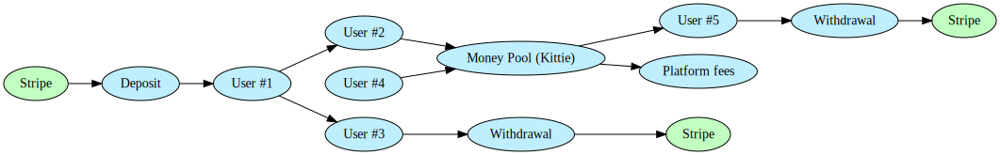
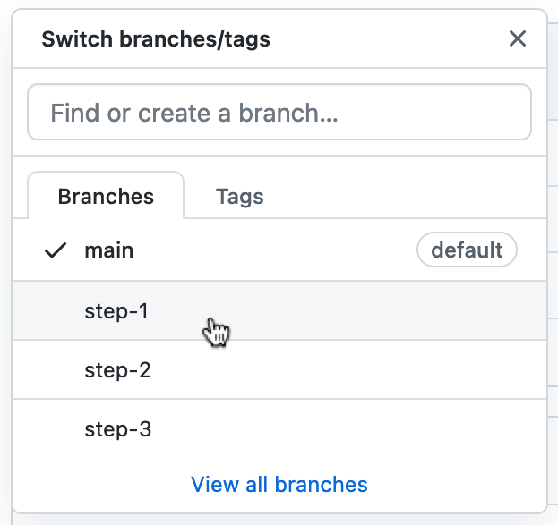

# Let's Build a Money-Pooling App: Kittie

Apps for sending money to and pooling money with friends like [Venmo](https://venmo.com/), [Lydia](https://www.lydia-app.com), or [Tikkie](https://www.tikkie.me/) are a part of our daily lives now. Internally, as you can imagine, these apps require keeping track of pretty complex money flows—which makes building one a perfect demonstration of Formance's capabilities. So, let's use Formance to build a money-pooling app together!

Kittie is a full-featured demo app to show you how Formance can help you manage complex money flows in your fintech apps. Kittie is a financial tool that lets users:
* deposit funds into a wallet
* send funds to a friend
* pool money with friends, and transfer that pool to someone else (with a commision for us)
* withdraw money from their wallet

We're going to build this app together step by step. Don't worry if you don't quite understand everything that's going on—everything will be explained in detail as we move forward.

**In Step 1** we're going to get the app scaffolded and running with barebones functionality with the different services we're going to use, including Formance Ledger. Users will be able to sign up and log in.

**In Step 2** we'll add functionality for topping up wallets and display wallet balances.

**In Step 3** we'll add the notion of friends, and the capability to transfer funds to friends.

**In Step 4** (not yet available) we finally get to see the app's namesake, kitties—a pool of money created by two or more friends that can then be sent off to someone else. You'll also learn how to structure commisions on these traansfers.

This is an ongoing tutorial, and future installments will address features like: Withdrawls, debugging, deploying to production, and questions _you_ have about how Formance works!

## How this tutorial works

This git repo contains every step of the tutorial in a different branch. You're currently in branch `main`, which is the starting place. To start the tutorial, checkout out branch `step-1`. Then follow along with the instructions in the file `README.md`, run the tests, and make sure everything is just right. Then when you're ready, move on to the next step by checking out the next branch, `step-2`. The next branch will be set up to start you off right where the previous step left off. This is helpful in case you missed something small, or ran into trouble and couldn't fully complete the step yourself. You will need to throw your changes away between steps with a `git stash` or `git reset --hard`, to keep things clean (but of course you can always copy your work to a different folder if you are making customizations you want to keep).

Ready to jump in? Change the branch above to `step-1` or [click this link](https://github.com/formancehq/kittie-app-tutorial/tree/step-1) to read the next step!
