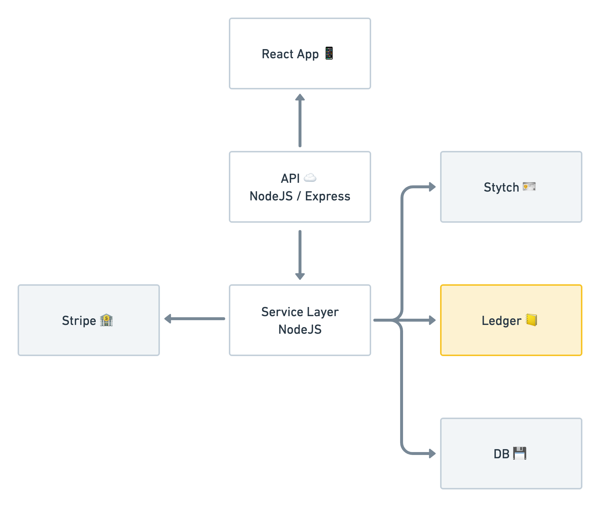
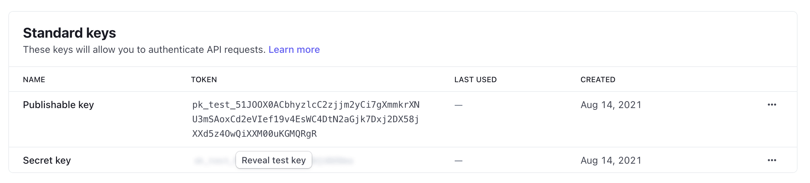
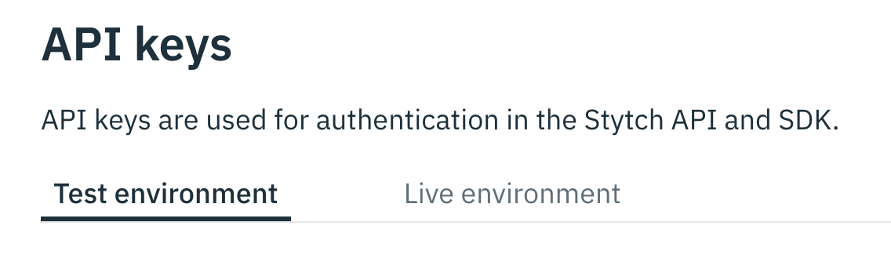
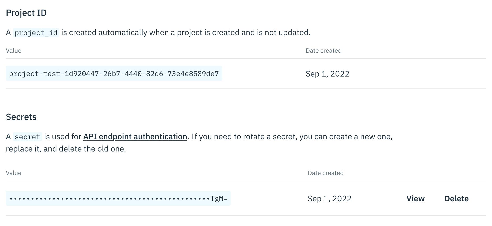
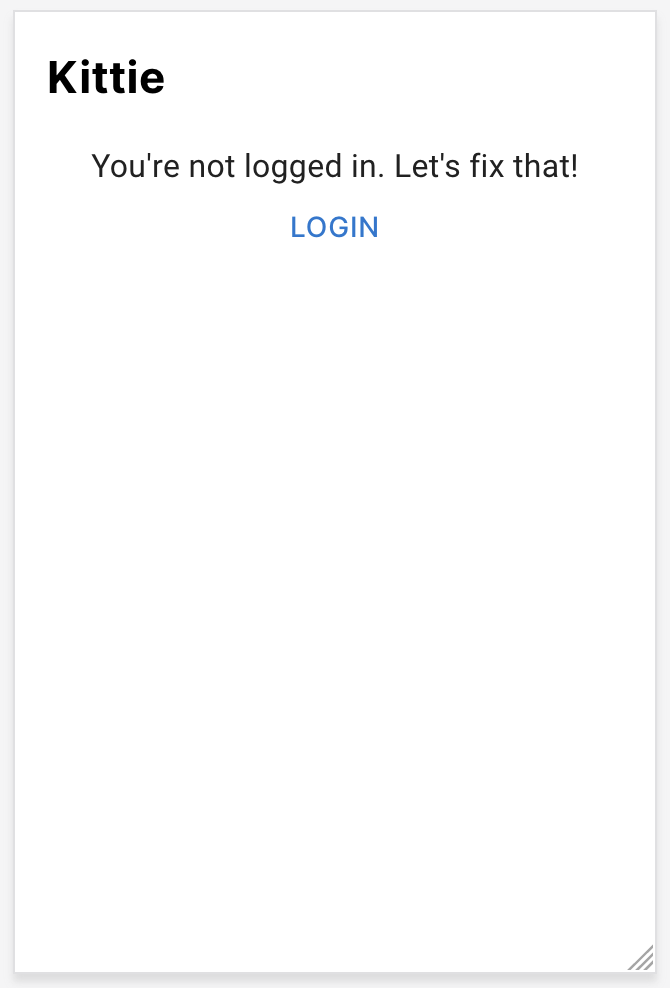
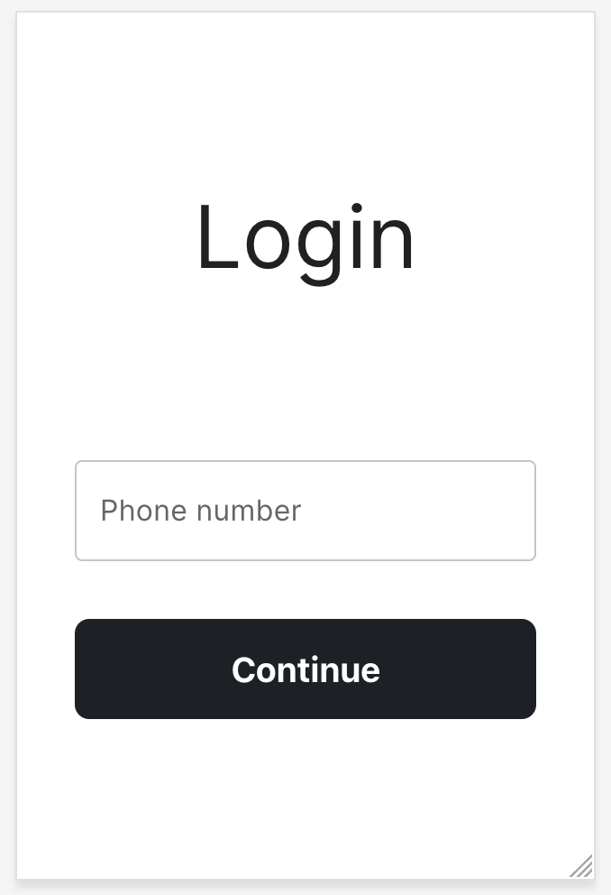
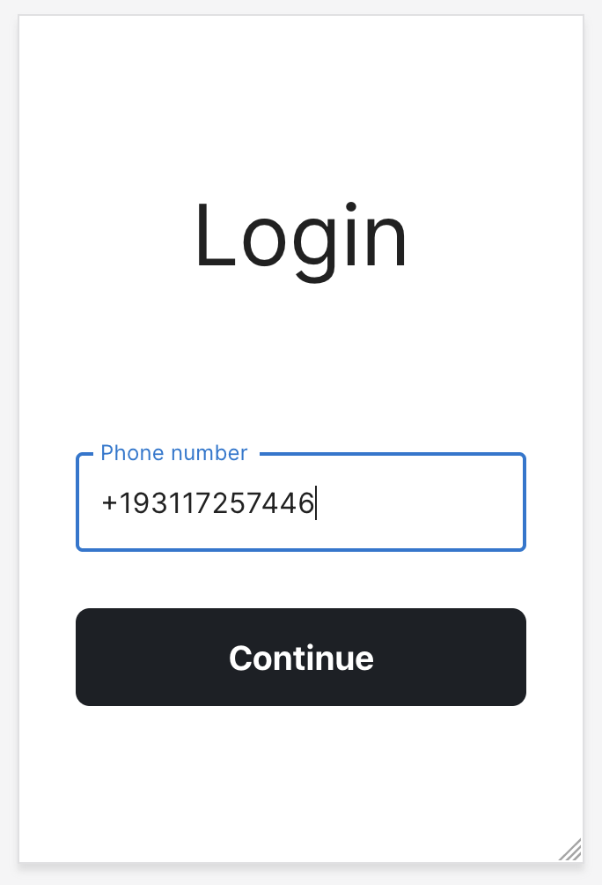
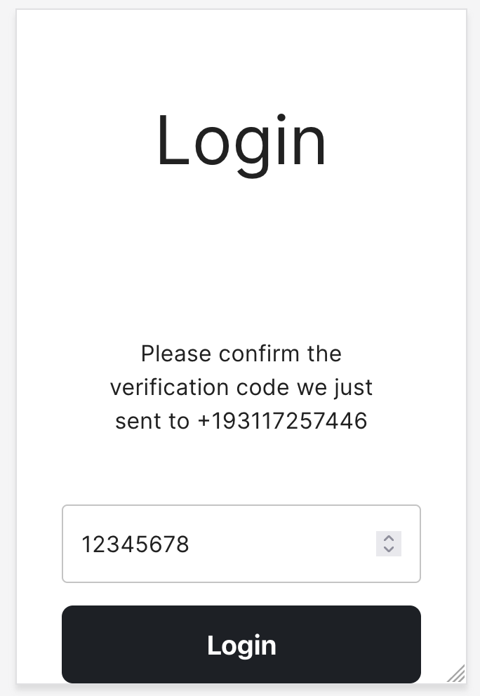
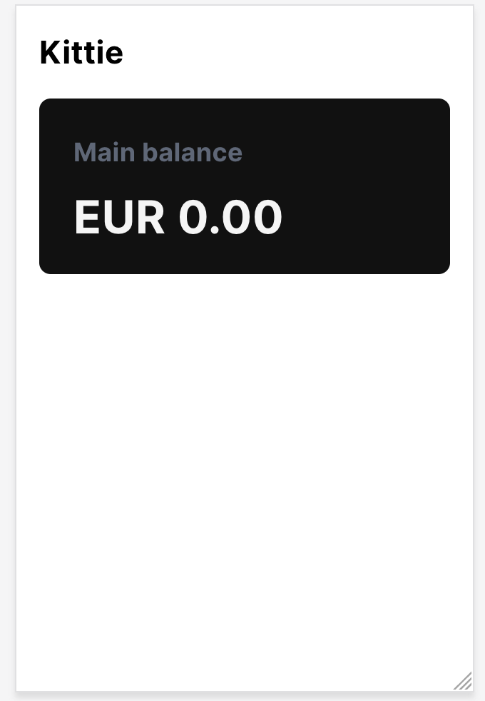

# Step 1: Scaffolding the app

Let's get started building Kittie!

First things first. If you haven't cloned this repo, do so now. Then checkout branch `step-1`:

```bash
git clone git@github.com:formancehq/kittie-app-tutorial.git
git checkout step-1
```

Before we begin implementing the speficics of Kittie, let's start by laying out the general architecture this app will use, and getting the various moving parts working.



Kittie is a webapp built using React and Typescript on the frontend, and NodeJS with Express and Typescript on the backend. In the backend, we'll distinguish between the API layer, which defines how the React app will define with our backend, from the services layer, which will implement the necessary functionality for the API endpoints to operate. In addition, Kittie uses several third-party services to ease our way: Stripe for payments processing, Stytch for authentication, and of course Formance Ledger for tracking money flows. We'll also need a database, but for now we'll use SQLite to keep things simple. The services layer will interact with these thirdy-party services directly.

In this step, we'll get a bare-bones app with this architecture up and running. At the end of this step, we will have:

* An Express-based backend with a single stub API endpoint that returns a simple text string
* A React frontend that hits that stub API endpoint
* All the third-party services we'll be using configured and ready to integrate.
* A local store with SQLite to manage state.

## The Scaffolding

We've provided you with a very basic full-stack app template, all in the `src` folder. Let's look at the folders and files, to understand the various parts of our app:

- `.env.example`: An example configuration file that we'll use to feed in configuration options, credentials, other secrets we need to work with the various third-party services we'll employ. We'll need to edit this file shortly.
- `package.json`: List of dependencies for this project. There is no need to edit this file.
- `yarn.lock`: Auto-generated from `package.json`. You must not edit this file.
- `tsconfig.json`: Configuration for the Typescript compiler. There is no need to edit this file.
- `src/front-app/`: Aource code for our React front end.
	- `src/front-app/pages`: A folder for each page in our app.
		- `src/front-app/pages/Home.tsx`: The landing page for our app.
		- `src/front-app/pages/Login.tsx`: The page for logging in or creating an account.
		- `src/front-app/pages/Logout.tsx`: The page for logging out.
		- `src/front-app/pages/components`: Custom React components we'll use to build up the pages in our app.
		    - `src/front-app/components/Balance.tsx`: A placeholder component that displays account balances. Right now it doesn't connect out to anything.
			- `src/front-app/pages/components/Button.tsx`: A custom button component.
			- `src/front-app/pages/components/Navbar.tsx`: The app's navigation bar.
			- `src/front-app/pages/components/PageHead.tsx`: Another component that makes things pretty.
	- `src/front-app/lib`: A place to store utility code.
		- `src/front-app/lib/api.ts`: A thin wrapper around [axios](https://axios-http.com/) for calling out to API endpoints in our backend.
	- `src/front-app/index.html`: The HTML container for our app. No need to edit this.
	- `src/front-app/index.tsx`: The React component for our app; it coordinates the pages to make sure everything flows together.
	- `src/front-app/global.css`: A CSS file that resets all styling to the default. We won't be editing this file.
- `src/server-app/`: source code for our API endpoints written with Express.
	- `src/server-app/api`: the home for each of our API endpoints.
		- `src/server-app/api/main.ts`: this file registers all of our endpoints with Express. This is the main entrypoint for our backend code.
		- `src/server-app/api/auth.ts`: the API endpoint for authenticating users with Stytch.
	- `src/server-app/db/`: connectors to a persistent store. To start with, we're just going to use `sqlite3` to keep things simple. The files here Won't require any editing.
		- `src/server-app/db/entities/User.ts`: An entity to define what a User is to our datastore.
	- `src/server-app/ledger/`: connectors to Formance Ledger. Not used just now, but we'll lean on these files in later steps
	  - `src/server-app/ledger/ledger.ts`: A bit of glue code to pull in the Formance Ledger SDK, and make calling our custom Numscripts straightforward.
	  - `src/server-app/ledger/chart.ts`: A bit more glue code to calculate wallet names from usernames.
		- `src/server-app/ledger/scripts/`: As we start adding money flows to our app, we'll need to describe those flows using Numscript. Each flow will get a new Numscript file in this folder.
	- `src/server-app/queries/`: Each money flow described in Numscript will need bridging into our app; this is where those bridges will live.
	- `src/server-app/service/`: This is where we keep the services layer code, which will implement the functionality for the API layer, and will integrate with third-party services like [Stripe](https://stripe.com/) and [Stytch](https://stytch.com/). We won't be editing the existing files, but we will be adding a lot of functionality to this layer in later steps.
	- `src/server-app/types/`: As we integrate Formance Ledger, this is where we'll create some custom datatypes to bridge Ledger with our Typescript backend.
		- `src/server-app/types/User.ts`: The `User` type.

## Setting up Third-party Services

Let's start by setting up the third party services we are going to use:

* **[Stripe](https://stripe.com/)** for payments processing.
* **[Stytch](https://stytch.com)** for authentication.

### .env

First, copy the example environment file to one ready to store the various secrets we're about to copy:

```bash
cp .env.example .env
```

Go ahead and open this file in your text editor so we can be ready to paste values in.

### Stripe

If you don't have an account with Stripe, you should [create one here](https://dashboard.stripe.com/register). Don't worry about connecting bank account information, for now we are only going to be using Stripe in test mode.

Log into your account and [visit the API keys page](https://dashboard.stripe.com/apikeys).

⚠️ Look to the top right of the page, be be **absolutely certain** that test mode is enabled before moving forward.


We need the publishable key for this app. The publishable key is an API key that is safe to share, and hence suitable for use in the front-end. The secret key, on the other hand, should never be shared, and is suitable for more secure operations in the back-end.



Copy the publishable key and secret key into your `.env` file:

```
STRIPE_PUBLISHABLE_KEY="pk_test_YOUR_PUBLISHABLE_KEY"
STRIPE_SECRET_KEY="sk_test_YOUR_SECRET_KEY"
```

⚠️ If your keys **do not** begin with `pk_test` or `sk_test`, you are using production keys! This is a mistake, and if you continue, real money will change hands (and you will pay fees for that). Make sure you have test mode enabled, as per the instructions above!

Finally, we need to set up a webhook. Stripe offers the option of emitting events (such as new transactions) to our backend via webhook—and we will want to receive notifications of money entering or leaving our systems, so let's set one up.

Normally, Stripe needs to see a public API endpoint it can reach, but for development purposes, Stripe has a command line tool that allows you to receive webhooks on your local development machine. [Visit this link](https://dashboard.stripe.com/test/webhooks/create?endpoint_location=local) to set up a local development webhook. You'll need to follow the directions on that page to download and install the Stripe CLI tool. Otherwise there is nothing else to do for this step, for now.

ℹ️ There is no need to run the Stripe CLI just yet. We'll come to that in a later step.


### Stytch

Next, let's set up our authentication service provider, [Stytch](https://stytch.com/). Stytch is a service that will allow us to authenticate users with magic links or SMS codes, rather than passwords. This makes it easier for us to manage our user accounts securely, since it relieves us of the burden of managing a secure password store.

If you don't have a Stytch account, you can [make one here](https://stytch.com/login).

Stytch organizes the apps you are securing by _project_, and they automatically create one for you when you first log in. We need the project ID, and its corresponding secret key.

Visit [the API keys dashboard](https://stytch.com/dashboard/api-keys).

⚠️ Just like with Stripe, make sure you're in the test environment!



You'll find the project ID and the secret key both on the same page:



Copy the project ID and secret key into the `.env` file:

```
STYTCH_PROJECT_ID="YOUR_STYTCH_PROJECT_ID"
STYTCH_SECRET="YOUR_STYTCH_SECRET KEY"
```

⚠️ If your keys **do not** begin with `project-test` or `secret-test`, you are using production keys! This is a mistake. Make sure you have test mode enabled, as per the instructions above!

That's all we need for Stytch for now. Let's move on.


## Configuring and Test Run

Now let's get our bare-bone app running, and make sure everything is operating as expected. There are a lot of moving parts, and we should be sure they all work together!

### Install dependencies

Everything here is running with Node. [Install Node](https://nodejs.dev/en/learn/how-to-install-nodejs/) if you haven't already. We're also using yarn to manage our dependencies and to execute our runners. If you don't have yarn installed, that's straightforward:

```bash
npm install -g yarn
```

Then, use yarn to install the dependencies for this app; it might take several minutes to complete.

```bash
yarn install
```

### Run backend

Now, let's start up the backend:

```bash
yarn run backend
```

If all goes well, you'll see this message after a moment:

```
app listening on 3022
```

#### Troubleshooting

You might not see that message! You might get an error.

If you see `error Command "ts-node-dev" not found.`, it's because you didn't install the dependencies—don't forget to to run `yarn install` first! You only need to do this once.

If you see `Error: Missing "project_id" in config`, it's because you didn't copy `.env.example` to `.env`, or your didn't fill out the fields.

### Run frontend

Open a second terminal, and navigate to the kittie repository. Then start the frontend

```bash
yarn run frontend
```

If all goes well, you'll see this message after a moment:

```
Server running at http://localhost:1234
```

Now visit [http://localhost:1234](http://localhost:1234). You should see a landing page like this:



Go ahead and click login. You'll be offered the chance to enter your phone number.



Enter your mobile number (don't forget your country code!), then press "Continue":



You'll receive a code over SMS. Enter that:



And you'll be taken to a screen showing that you have no balances.



If you made it here, congratulations! Everything is up and running.

### Troubleshooting

If when you enter your phone number, nothing happens, it is likely that the backend isn't running. Make sure that both the frontend and the backend are running in seperate terminal windows.

If you run into problems entering your authentication code, it's possible that something got confused in the backend. To keep the code simple, there is little error handling happening with the authentication flow, and it might be that Stytch's user list and your local datastore are out of sync with each other. To reset the users do these two things:

1. Visit the [Stytch user management page](https://stytch.com/dashboard/user-management) and delete all users

2. Delete the local sqlite database as well:

```bash
rm kittie.sql
```

3. Finally, also be sure the [frontend is logged out](http://localhost:1234/logout).


## On To Step 2

And that's it for Step 1! In this step, we got all the tooling required up and running, and verified that all the parts are operating as expected. We can create an account, log in, log out, and view a dummy balance value. If you've done that, we're ready to move on.

To move on to Step 2, all you need to do is switch the branch to `step-2` in the GitHub UI just above, or [click this link](https://github.com/formancehq/kittie-app-tutorial/tree/step-2).

In Step 2, we'll start adding some functionality to our new app: We'll handle connecting to Ledger to display their wallet balance to them, and connecting to Stripe to top up the wallet.