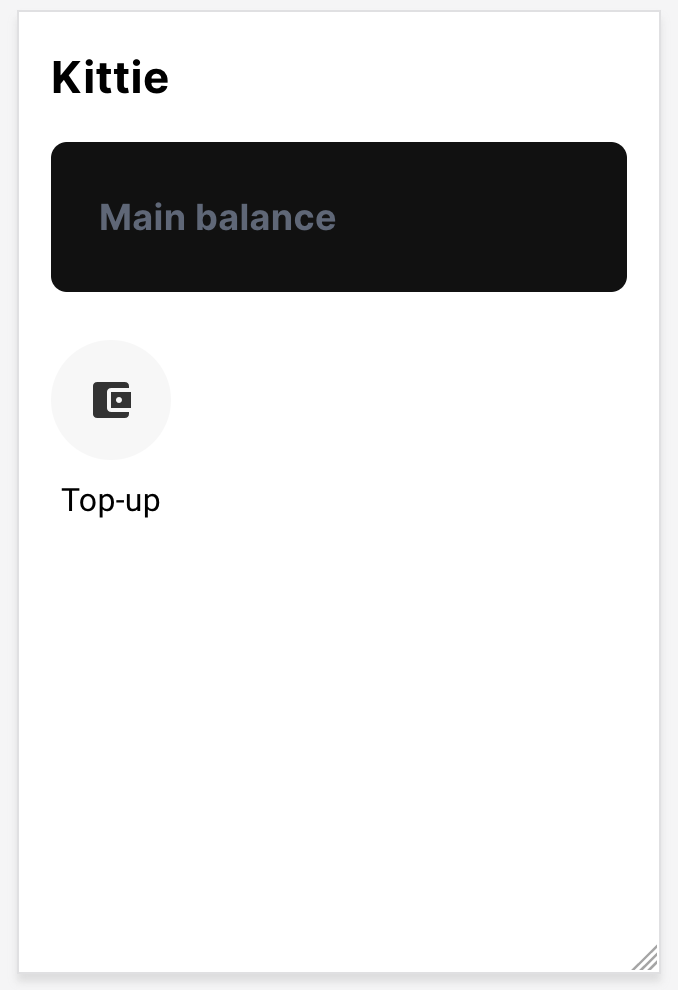
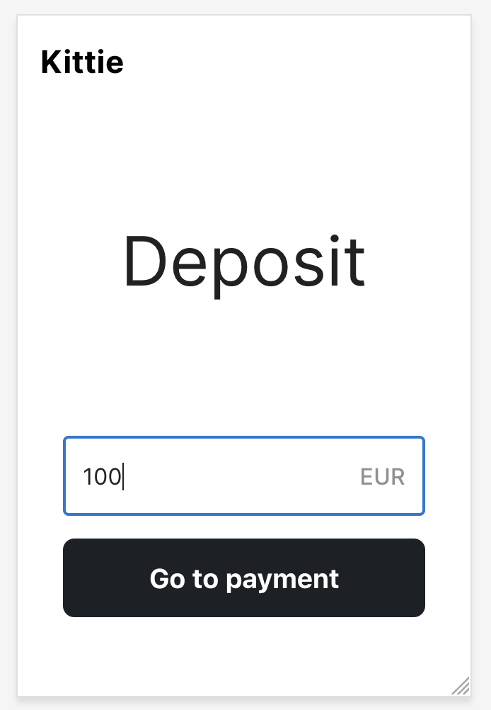
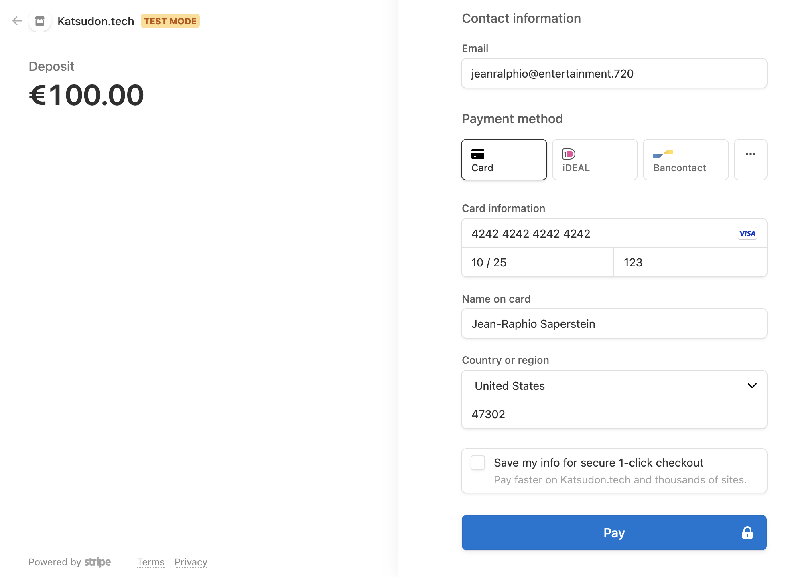
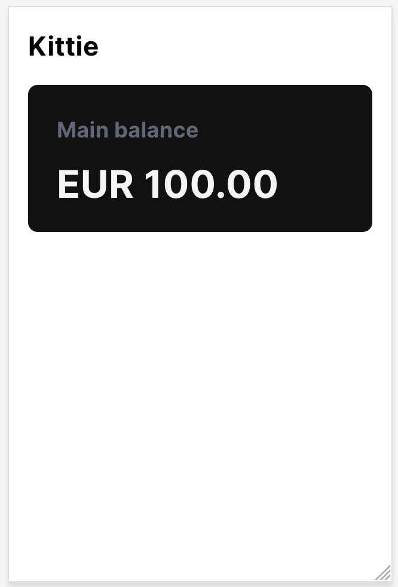
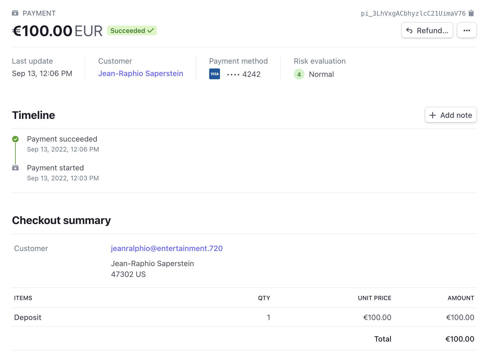

# Step 2: Topping up the wallet

In this step, we're going to start wiring up our app to Ledger and tracking our first money movements. Before we can move money within our app, you need to be able to top-up your balance! So let's add that in: We'll use Stripe to accept payments, and Formance to record them to your wallet. We'll also leave some space for adding fraud checks in the future.

First things first. You might need to discard any changes or edits you made in Step 1 (feel free to copy them to another folder first!). Then checkout branch `step-2`:

```bash
git reset --hard
git checkout step-2
```

Finally, make sure your frontend and backend are running in seperate terminals:

```bash
yarn run frontend
```

```bash
yarn run backend
```

## Set up and run Formance Ledger

First, let's get Formance Ledger installed and running. Ledger is an open-source ledger that stores financial transactions as a directed graph, and is the very heart of this demo! [Visit the Formance docs](https://docs.formance.com/oss/ledger/get-started/installation) for instructions for your particular platform.

Once you've got Ledger installed, let's get it running in a new terminal:

```bash
yarn run ledger
```

If you see and error `numary: command not found`, you probably don't have `numary` (the CLI command for Ledger) in your PATH. You'll need to double-check the installation.

Otherwise, you should see quite a lot of debugging information, with `[Fx] RUNNING` at the bottom of your screen. Congratulations!

## Set up and run Stripe CLI, and get webhook secret

Our app also needs to listen for events from Stripe via a webhook. Stripe has a great command-line tool for forwarding events to your local machine. [Install the Stripe CLI](https://stripe.com/docs/stripe-cli). Note that we only need this in development, and it won't be require in production, because of course your webhook will be exposed to the public internet.

Be sure you've logged in (you only need to do this once):

```bash
stripe login
```

Then, start the Stripe event listener in a new terminal with

```bash
yarn run stripe
```

You'll see this in the output:

```> Ready! You are using Stripe API Version [2020-08-27]. Your webhook signing secret is whsec_somethingsomething```

We need that webhook signing secret! Copy the string beginning with `whsec_` into your `.env` file:

```
STRIPE_WEBHOOK_SECRET="whsec_somethingsomething"
```

## Hooking up Ledger and displaying the actual balance

OK, we have all four services running: The frontend, the backend, the ledger, and the Stripe event listener. Let's start hacking.

The first feature we're going to build out is showing the user's wallet balances. Right now, we just have a stub that displays no balances, but it's time to connect this through to our ledger. Let's start with the frontend.

### Frontend

We have a React component called `Balance` that displays the users balances. Open `src/front-app/pages/components/Balance.tsx`, and look at line 10, where it reads "placeholder for later". We're going to replace that line with this code:

```tsx
    (async () => {
        const res = await api.get('/wallets/balance');

      if (res.status !== 200) {
          return;
      }

      setBalances(res.data);
    })();
```

Now, the `Balance` component will ask our backend API at `/wallets/balance` for the user's balance, and display what it gets back, or nothing if the API call fails.

### Backend

We're calling an API endpoint in the frontend—now we need to add that API endpoint to our backend.

First, let's write the code that actually queries Ledger for the user's balance. Create a new file called `src/server-app/service/wallets.ts` and add this code:

```tsx
import { wallet } from "../ledger/chart";
import { ledger, script } from "../ledger/ledger";
import { User as UserInterface } from "../types/User"

export const getMyBalance = async (u: UserInterface) => {
  const { balances } = await ledger.getAccount(wallet(u));

  return {
    'EUR/2': 0,
    ...balances,
  }
}
```

This code calls the Ledger SDK, requesting all balances for the given user's wallet, and returns a value corresponding to €0.00 if there are no balances found.

OK, the service code is done, let's add a new API endpoint that calls this service. Create a new file for the corresponding API endpoint at `src/server-app/api/wallets.ts` and add this code

```ts
import { Router } from "express";
import { getMyBalance } from "../service/wallets";

export const app = Router();

app.get('/balance', async (req: any, res) => {
    const balance = await getMyBalance({
      id: req.auth['userId'],
  });

  res.json({
      ...balance,
  });
});
```

This is just a thin Express wrapper around the service code we just wrote. The API uses the user's authentication to identify which balances to look up, and returns their balance.

Finally, we need to tell Express about our new backend. Let's add it to our app's router in `src/server-app/api/main.ts`. Add this code at or around line 18:

```ts
import { app as wallets } from './wallets';
```

And at line 39, after the line that reads `app.use('/api/auth', auth);` add this:

```ts
app.use('/api/wallets', wallets);
```

Now! The fun part, let's make sure this works. You shouldn't see any errors in the output of the various services running. [Open the website](http://localhost:1234/), and login if need be. Because you don't yet have any balances, nothing will look different (because you don't yet have any balances!) but nothing should crash or create an error either. No errors? Great, let's move on.

### Troubleshooting

If you're having trouble logging in, it's likely because your local database and Stytch are out of sync. Remove `kittie.sql`, and restart the backend process. Then delete all users from [the Stytch user management dashboard](https://stytch.com/dashboard/user-management) and try again.

## Add UI for topping up the balance

Ok, we can show a zero balance, but what fun is that? Let's wire up Stripe so we can start accepting wallet topups. We need to create a new page in the UI to kick off the topup process, create a new API endpoint to deliver a Stripe checkout page, and a webhook for acknowledging Stripe's events. Let's start with the UI.

### The Deposit page

Create a new file called `src/front-app/pages/Deposit.tsx` and add this code:

```tsx
import { Box, Container, Input, TextField, Typography } from '@mui/material';
import * as React from 'react';
import { api } from '../lib/api';
import { Button } from './components/Button';
import { Navbar } from './components/Navbar';
import { PageHead } from './components/PageHead';

export const Deposit = () => {
    const [amount, setAmount] = React.useState(0);

  async function checkout() {
      const res = await api.post('/wallets/deposit/link', {
        amount: {
          amount: amount * 100,
        asset: 'EUR/2',
      },
      redirect: {
        success: `${window.location.origin}`,
        fallback: `${window.location.origin}`,
      },
    });

    if (!res.data.url) {
        return;
    }

    window.open(res.data.url, '_blank');
  }

  return (
    <>
      <Navbar></Navbar>
      <PageHead>Deposit</PageHead>
      <Container>
        <Box textAlign="center" pl={2} pr={2}>
          <div>
            <TextField type="text" placeholder="Amount"
              onChange={(e) => setAmount(parseInt(e.target.value))}
              InputProps={{
                  endAdornment: (
                  <Box sx={{
                      ml: 1,
                    fontWeight: 'medium',
                    opacity: 0.5,
                  }}>EUR</Box>
                ),
              }}
              sx={{
                  mb: 2,
              }} fullWidth/>
          </div>
          <div>
            <Button type="submit" onClick={checkout} fullWidth>Go to payment</Button>
          </div>
        </Box>
      </Container>
    </>
  )
}
```

The UI straightforwardly create a text field for inputting a monetary amount to deposit, and a button for submitting the field.

The submit button calls the `checkout()` function, which submits the contents of the field to an API endpoint at `/wallets/deposit/link`. This endpoint will return a URL pointing to a Stripe checkout page to complete the topup, and on success, opens that URL in a popup.

### Add an action button from the landing page

Let's create a new button on the landing page for topping up the balance. Open `src/front-app/pages/Home.tsx`. Look at line 81, where it says "future action icons here"—this is where we'll be adding action buttons for different features in Kittie. Replace that comment with the following code:

```tsx
          <ActionIcon path="/deposit" text="Top-up" icon={
            <IconBalance/>
          }/>
```

### Add new route to App router

Finally, we need to tell React about our new page. Let's add it to React's router. Open `src/front-app/index.tsx` and at line 14 import our new page:

```tsx
import { Deposit } from './pages/Deposit';
```

Then, at line 40, add the route to the App:
```tsx
            {/*Money matters*/}
            <Route path="/deposit">
              <Deposit></Deposit>
            </Route>
```

[Reload the app](http://localhost:1234/), and you should see the new action icon.



If you click it, or [visit /deposit](http://localhost:1234/deposit) you'll see our new page:



Of course, if you try to deposit money, nothing will happen because we need to write the API endpoint to serve up the Stripe payments panel. Let's do that next.

## Load up Stripe payments panel

When you click the "Go to payment" button, we want to load up a Stripe payments panel so the user can enter their card or other payment information. This button posts to the API endpoint `/wallets/deposit/link`. But that doesn't exist yet, so let's write it now.

### Groundwork

There's some groundwork we need to lay first. We need a type to define monetary amount, because we're using TypeScript. This is because monetary amounts aren't just a number, but require a currency as well. `1.00` is a not a unit of currency, but `€1.00` is. Ledger uses [Unambiguous Monetary Notation](https://docs.formance.com/oss/ledger/reference/unambiguous-monetary-notation) to specify monetary amounts, and we'll need to adopt that here as well.

Create a new file called `src/server-app/types/Monetary.ts` and define our new type as such:

```ts
export type Monetary = {
  amount: number;
  asset: string;
}
```

### Service for generating Stripe payment panels

The Stripe SDK can create what it calls a checkout session. It requires a monetary amount and a URL to redirect to upon completing the form, and returns a dynamically generated URL to display to the user on the frontend. Let's write a service that uses that SDK functionality. Create a new file `src/server-app/service/processing.ts` and add the following code:

```ts
import { Monetary } from "../types/Monetary"
import { stripe } from "./stripe";
import { v4 as uuid } from 'uuid';

export const createDepositLink = async({
  amount,
  userId,
  redirect,
} : {
  amount: Monetary,
  userId: string,
  redirect: {
    success: string,
    fallback: string,
  }
}) : Promise<string> => {
  const session = await stripe().checkout.sessions.create({
    line_items: [
      {
        price_data: {
          currency: 'EUR',
          product_data: {
            name: 'Deposit',
          },
          unit_amount: amount.amount,
        },
        quantity: 1,
      },
    ],
    mode: 'payment',
    success_url: redirect.success,
    cancel_url: redirect.fallback,
    metadata: {
      userId: userId,
    }
  });

  return session.url;
}
```

This code creates a function `createDepositLink` that asyncronously calls the Stripe SDK, and returns a promise that resolves to a URL.

### Add API endpoint

Now we need to add an endpoint that calls the new service above. Since this API endpoint is related to wallets, let's add it to our existing `/wallet` endpoint in `src/server-app/api/wallets.ts`.

We first need to import our service. Add this near the top of the file:
```ts
import { createDepositLink } from "../service/processing";
```

Then, add the endpoint handler at the bottom of the file:

```ts
app.post('/deposit/link', async (req: any, res) => {
  const url : string = await createDepositLink({
    amount: req.body.amount,
    userId: req.auth['userId'],
    redirect: req.body.redirect,
  });

  res.json({
      url,
  });
});
```

## Marking funds received in the ledger

When a user sends us funds, Stripe will notify us with an `checkout.session.completed` event on our a webhook we provide. This webhook is essentially just another API endpoint that we can add to our backend. So, let's write code to listen for this event, and record the transaction in Ledger.

This might be surprising, but we're going to record this transactions in two steps. First, when Stripe notifies us, we're going to mark the funds received as "in flight" by transferring them to a temporary holding account. What this means is that we will acknwedge receipt of the funds, but we won't _just yet_ release them to the user's wallet. Then, we move the in-flight funds from the holding account to the user's wallet.

There are two reasons to record the transaction this way. The first is that it leaves a very clear, auditable trail of where the funds came from. If we record the Stripe transaction ID to the metadata of the holding account, we can say with absolute confidence where every Euro in our ledger originated. The second reason is that we create a gap between receiving and releasing funds in which we can perform all kinds of due diligance like fraud detection and prevention. We won't be doing that at this stage of the tutorial, but it's good to create that gap now. We have more information on implementing funds in flight in the [Formance use-case library](https://www.formance.com/use-cases-library/17371866).

### Describe the transactions with Numscript

Let's write Numscript templates to describe the two transaction we want to create for each topup. First, create a file called `src/server-app/ledger/scripts/create-deposit.num` and add this code:

```
vars {
  monetary $amount
  account $deposit
}

send $amount (
  source = @world
  destination = $deposit
)
```

This Numscript moves money from the outside world by drawing from a special account called `@world`. It moves the money into the account specified, which our API will specify as a temporary holding account. But this template can be reused for any kind of movement of money from the outside world.

Next, to move in-flight funds into a users wallet, we need a second Numscript template. Create a file called `src/server-app/ledger/scripts/process-deposit.num` and add the following:

```
vars {
  account $deposit
  account $user = meta($deposit, "user")
}

send [EUR/2 *] (
  source = $deposit
  destination = $user
)
```

This template expects a holding account that contains metadata specifying the user the funds are intended for, and then moves everything in the holding account to the user's wallet.

### Holding accounts

The file `src/server-app/ledger/chart.ts` contains helper functions to construct account names. Right now, it only knows how to construct the wallet account name from a user name. Let's add a method to construct temporary account for holding deposits in flight. We want our deposit accounts to have a name like `deposit:1234` where `1234` is a unique string identifying the transaction. Open `src/server-app/ledger/chart.ts` and add this to the end:

```ts
export const deposit = (id: string) => {
  return `deposits:${id.replace(/\-/g, '')}`;
}
```

### Service to record transactions

Now, let's add a service for handling the deposit. For now, it will call the two Numscript templates above, one after the other: Marking the funds as in flight, and then immediately making them available in the user's wallet. Later we can add fraud-prevention measures between the two.

Open `src/server-app/service/processing.ts` and add the following near the top:

```tsx
import { deposit, wallet } from "../ledger/chart";
import { ledger, script } from "../ledger/ledger";
```

Then, add this to the bottom

```tsx
export const processDeposit = async ({payment} : {
  payment: any,
}) => {
  const dep = deposit(uuid());

  await ledger.execute(script('create-deposit'), {
    deposit: dep,
    amount: {
      amount: payment['amount_total'],
      asset: 'EUR/2',
    },
  });

  await ledger.setAccountMeta(dep, {
    user: {
      type: 'account',
      value: wallet({
        id: payment['metadata']['userId'],
      }),
    },
  });

  await ledger.execute(script('process-deposit'), {
    deposit: dep,
  });
}
```

This service code does three things in order: It first executes `create-deposit.num` moving the specified amount into a deposit account named with a new globally unique identifier. It then adds the Stripe transaction ID as metadata to that account, for auditability of the transactions. Thirdly, it then executes `process-deposit.num`, moving the funds from the temoporary holding account into the user's wallet.

### Add the webhook

Now let's write the webhook that calls the service code above. Create a new file `src/server-app/api/hooks.ts` and add:

```ts
import { raw, Router } from "express";
import { processDeposit } from "../service/processing";
import { stripe } from "../service/stripe";

export const app = Router();

app.post('/stripe', raw({type: 'application/json'}), async (req: any, res) => {
  let event;

  try {
    event = stripe().webhooks.constructEvent(
      req.body,
      req.headers['stripe-signature'],
      process.env['STRIPE_WEBHOOK_SECRET']
    );
  } catch (err) {
    return res.sendStatus(400);
  }

  if (event.type !== 'checkout.session.completed') {
    return res.sendStatus(200);
  }

  await processDeposit({
    payment: event.data.object,
  });

  res.json({});
});
```

The webhook first asks the Stripe SDK to validate that the call originated from Stripe (and not a malicious third party) by checking the cryptographic signature on the request body. It then filters out all events that are not `checkout.session.completed`. And finally, it calls `processDeposit()`, which we just wrote above, and returns an empty response.

### Carve out exemptions

The Stripe webhook differs from our other API endpoints in two key ways: First, it won't use our app's user authentication mechanism, so we need to exempt it from those checks. Second, Stripe performs its own authentication by signing every request it sends to our webhook. This prevents malicious users from abusing our webhook to fraudulently create fake deposits. To check the signature, Stripe requires the raw request string.

Open `src/server-app/api/main.ts` and add this at line 19:

```ts
import { app as hooks } from './hooks';
```

Then let's set those exemptions. Find line 23, which reads `app.use(express.json());`. This line tells Express to JSON-parse every request body, for our convenience. We need to carve our an exemption for the webhook. Replace this line with:

```ts
// Use JSON parser for all non-webhook routes
app.use(
  (
    req: express.Request,
    res: express.Response,
    next: express.NextFunction
  ): void => {
    if (req.originalUrl === '/api/hooks/stripe') {
      next();
    } else {
      express.json()(req, res, next);
    }
  }
);
```

Then at line 49, just below the line `/^\/api\/auth/,`, add this snippet to exclude the webhook from our user authentication system. 
```ts
    /^\/api\/hooks/,
```

Finally, add the webhook to the Express router. At line 55, add:

```ts
app.use('/api/hooks', hooks);
```

And we're ready to test it out!

## Testing

Let's add some funds to our wallet! Make sure all four services are running in seperate terminals:

```bash
yarn run frontend
```

```bash
yarn run backend
```

```bash
yarn run ledger
```

```bash
yarn run stripe
```

And visit the site at [localhost:1234/](localhost:1234/). Sign in if you haven't yet


Click the "Top-up" button.


Fill in a value, doesn't matter which, and click the "Depost" button. You should be taken to a Stripe checkout page. Make sure that popups are enabled for localhost!



Make sure that you see the yellow "TEST MODE" indicator at the top-left! If you don't, then you did not use your testing credentials on Stripe, and real money is about to change hands!

Fill out the form. In test mode, you can use [Stripe's test cards](https://stripe.com/docs/testing), including the card `4242 4242 4242 4242`. These cards accept any valid future expiration date, three-digit CVC, name, and postal code, so just fill out the rest as you like.

Click Pay, and after a moment, you'll be taken back to the landing page, only this time with a balance!



Finally, we can verify that the funds were well and truly (…well, this is test mode, so fictitiously) deposited [in your Stripe dashboard](https://dashboard.stripe.com/test/payments).



## On To Step 3

And that's it for Step 2! In this step, we learned how to retrieve a user's wallet balance. Then we wired up Stripe for payment processing, and created some UI for users to top-up their account. Then we created the Numscript templates to model the money movements. And finally, we created a webhook to receive notifications of deposits from Stripe.

To move on to Step 3, all you need to do is switch the branch to `step-3` in the GitHub UI just above, or [click this link](https://github.com/formancehq/kittie-app-tutorial/tree/step-3).

In Step 3, we'll learn how to add friends, and send them money.